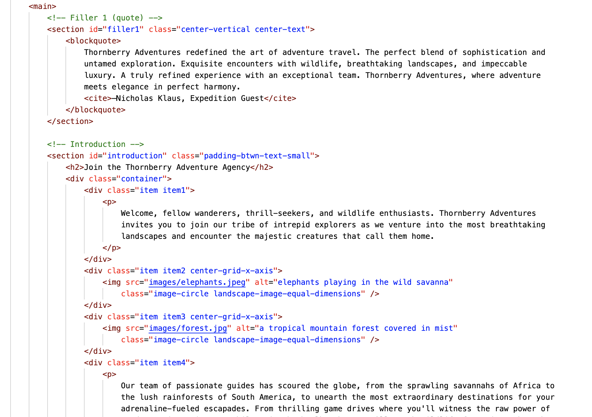
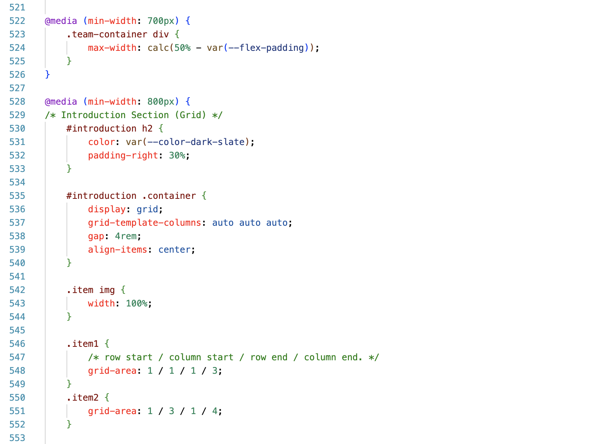
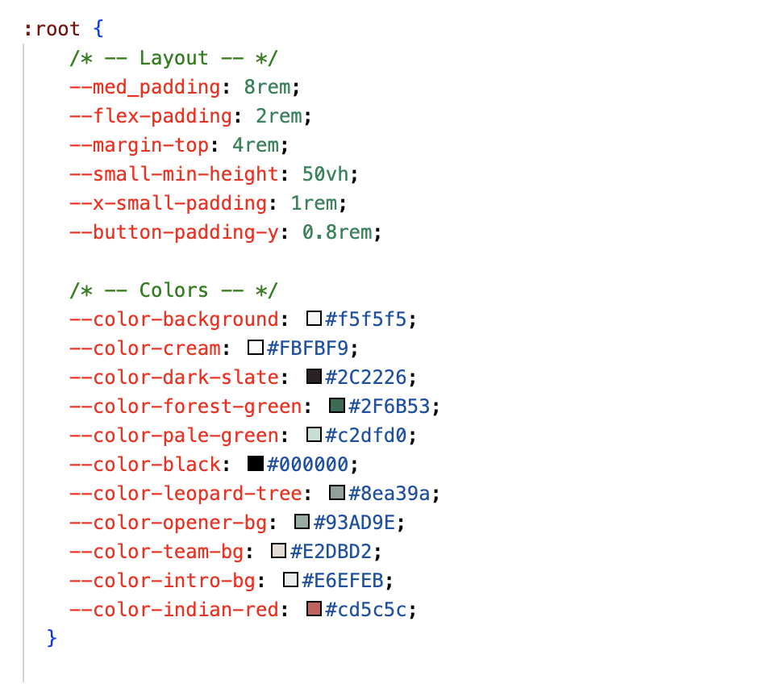
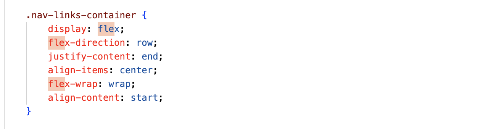
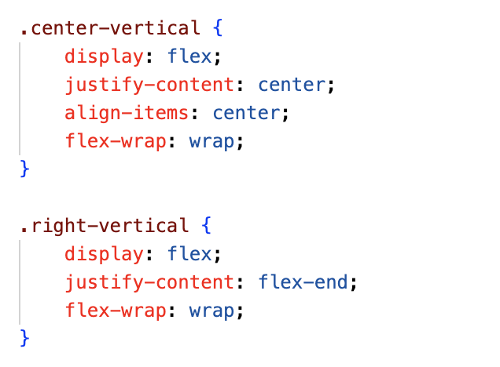
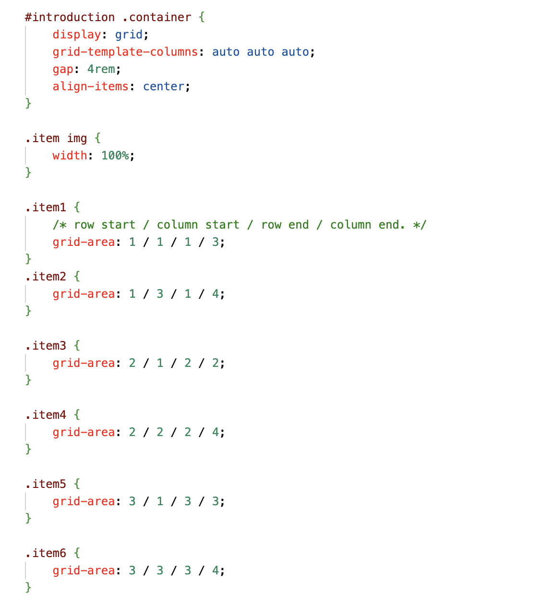
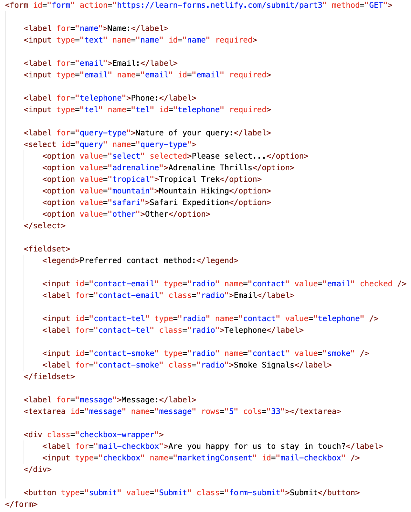

## 1. Structure a site using semantic HTML to aid accessibility

One of our key principles was building an inclusive and accessible website. We achieved this by meticulously employing semantic HTML elements to enhance the site's structure and navigation. For instance, we used `nav` for the navigation bar, `h1` for the main heading, and `section` for grouping related content, making it easier for all users, including those with disabilities, to comprehend and interacted with our site seamlessly.

## 2. Ensure a web page is readable for screen readers

Our dedication to inclusivity extended to users who relied on screen readers to access the web. To support them, we diligently provided descriptive alt text for images, such as `img alt="Profile picture - John Doe"`, which conveyed essential information about the image's content. Additionally, we managed focus appropriately, ensuring that screen readers navigated the page logically and efficiently, creating a welcoming experience for all users.

## 3. Ensure our UI has sufficient colour contrast so that everyone can perceive it comfortably

We took the user experience seriously, and that included visual comfort. To make our UI accessible to individuals with visual impairments, we carefully chose color combinations with adequate contrast. For example, we used CSS to define a color scheme like color: #333 against a background color like background-color: #f7f7f7, creating a pleasant and readable experience for all users.

## 4. Use various tools to check that our website meets accessibility criteria

Ensuring accessibility was a top priority, and we employed a range of tools and techniques to verify our website's compliance. By utilizing automated testing tools like Lighthouse and aXe, we automatically assessed accessibility issues and took appropriate corrective actions. Additionally, our team performed manual evaluations, ensuring that our site adhered to the most stringent accessibility criteria.

## 5. Use CSS media queries to ensure our content is always presented effectively on screens of different sizes

With an ever-increasing variety of devices, it was vital to maintain a consistent user experience across all screen sizes. Our approach involved using CSS media queries to adapt our content dynamically. For instance, we adjusted the layout with @media queries like @media screen and (max-width: 768px) to provide an optimal view for mobile users, ensuring they could enjoy our content on the go.

## 6. Demonstrate a mobile-first approach to building a website

To cater to the mobile-centric world, we followed a mobile-first approach in our development process. This meant initially designing and optimizing our site for mobile devices. As an example, our CSS styles started with mobile-friendly declarations, then gradually enhanced for larger screens. This ensured a smooth and intuitive experience for all users, regardless of their device.

## 7. Use CSS variables to apply repeated colours to HTML elements

Maintaining consistency in our design was made easier with CSS variables, known as custom properties. By defining primary colors like --primary-color: #007bff and reusing them throughout the stylesheet, we created a cohesive visual identity. This approach not only streamlined our code but also enabled quick and consistent updates across the site.

## 8. Use CSS Flexbox to style children in a single-direction layout (ie a row or a column)

CSS Flexbox empowered us to craft flexible and responsive designs with ease. For instance, we utilized Flexbox to arrange elements in the following code snippet, which allowed us to create a visually appealing layout that adjusted seamlessly to varying screen sizes:

## 9. Use CSS Grid to style children in two-direction layout

For more complex layouts, we leveraged CSS Grid, which provided us with a two-dimensional grid system. By defining rows and columns, we created intricate designs that adapted effortlessly to different content structures. For example:

## 10. Ensure our Git commit history tells a coherent story

Collaboration and project management relied on a well-maintained Git commit history. By writing clear and descriptive commit messages like "Added contact form with validation" or "Fixed accessibility issue with navigation," we ensured that each commit contributed to a coherent and organized development journey.

## 11. Use the appropriate input types in HTML forms for gathering different types of information

When designing HTML forms, we carefully considered the user's needs and employed the right input types. For example, we used `input type="email"` for email addresses, `input type="checkbox"` for multi-choice options, and `input type="date"` for selecting dates. This ensured an intuitive and user-friendly form-filling experience for all visitors.

